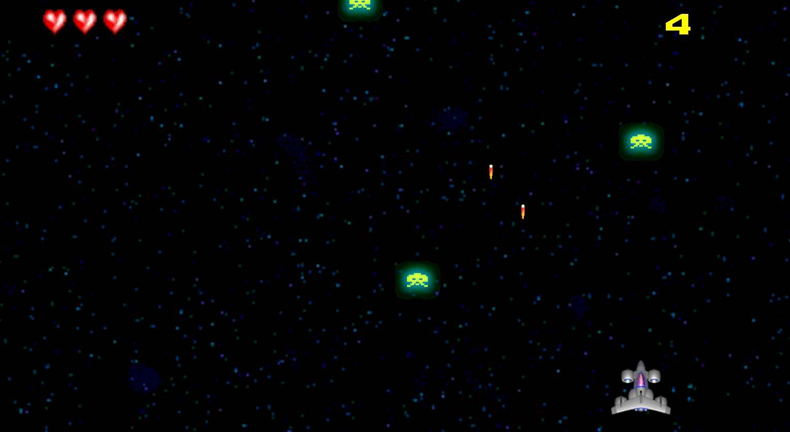

# Space Invaders (Unity 2D)

---

## Índice
1. [Descripción](#descripción)  
2. [Tecnologías](#tecnologías)  
3. [Requisitos](#requisitos)  
4. [Instalación](#instalación)  
5. [Cómo jugar](#cómo-jugar)  
6. [Estructura del repositorio](#estructura-del-repositorio)  

---

## Descripción
Clon de Space Invaders en Unity 2D. Manejas la nave con WASD o flechas, disparas con la barra espaciadora y tienes tres vidas para eliminar tantas oleadas de invasores como puedas. Con este proyecto aprendí a usar prefabs, organizar escenas y escribir scripts en C#.

---

## Tecnologías
- Unity (2D)  
- C#  

---

## Requisitos
- Unity Editor 6000.0.46f1  
- Linux/Mac OS/Windows
- Teclado  

---

## Instalación
    git clone https://github.com/eaomarb/SpaceInvaders.git
    cd SpaceInvaders
    # Abre el proyecto con Unity Hub y ejecuta la escena Assets/Scenes/Space.unity

---

## Cómo jugar
- **Mover**: teclas WASD o flechas  
- **Disparar**: tecla Espacio  
- **Vidas**: 3 corazones
- **Objetivo**: conseguir la máxima puntuación derrotando al mayor número de enemigos  

---

## Estructura del proyecto
    Assets/
        Scenes/       # Escenas de Unity
        Prefabs/      # Prefabs de objetos
        Sprites/      # Imágenes y sprites
        Scripts/      # Lógica en C#
